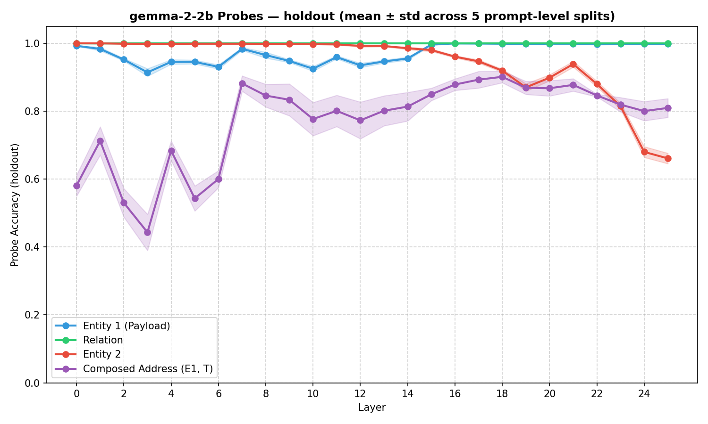
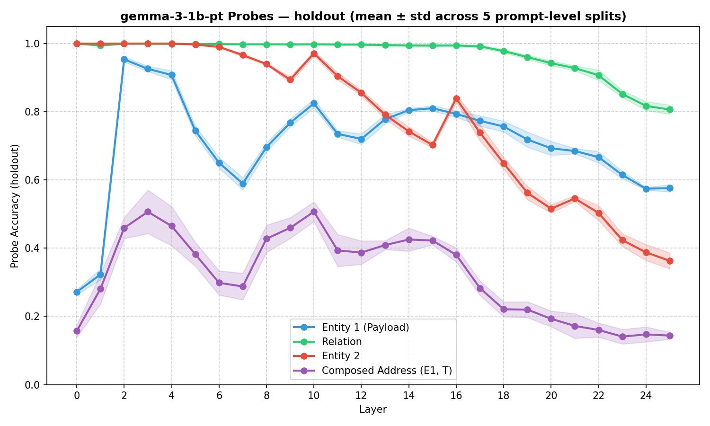
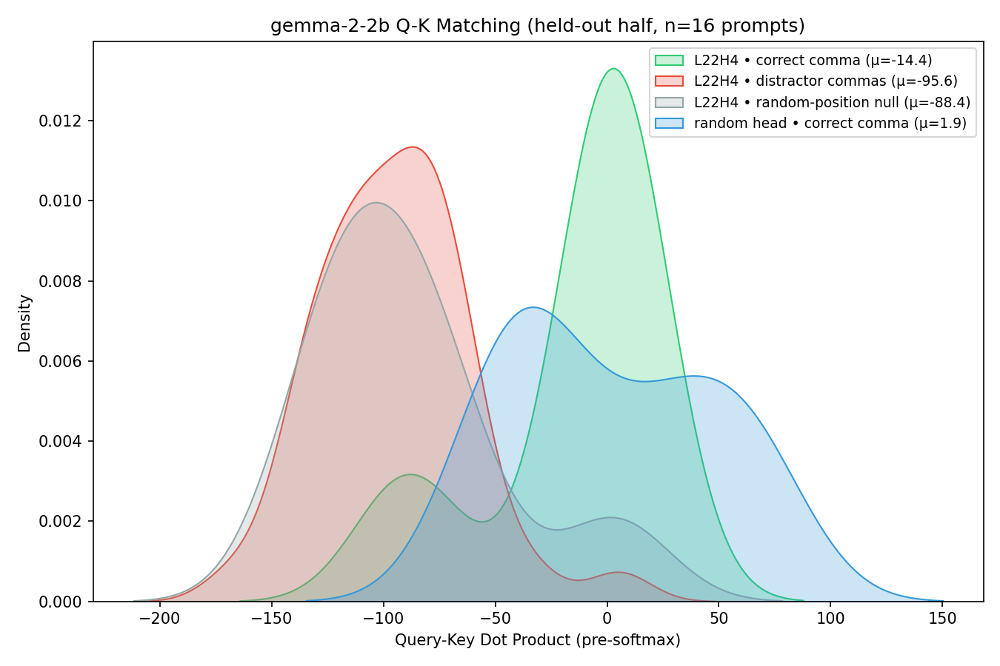
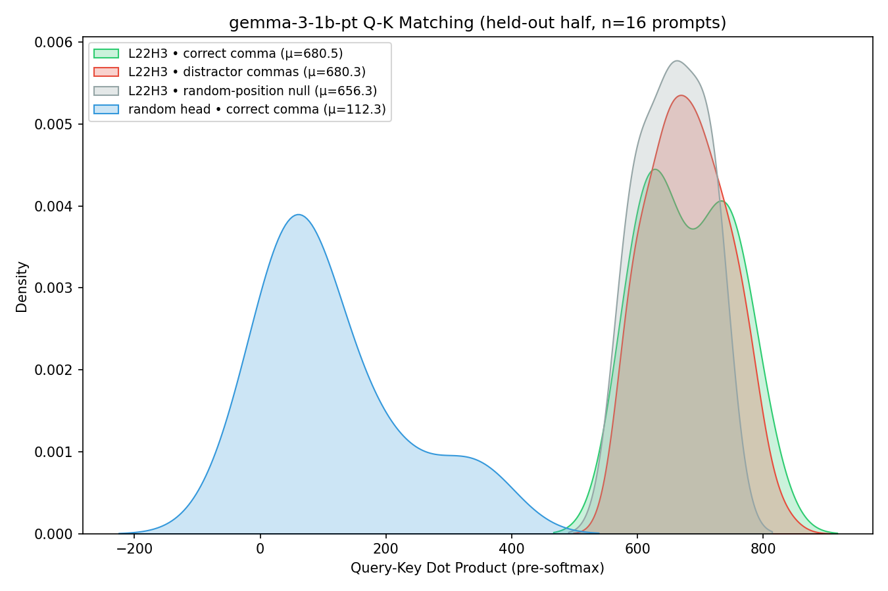
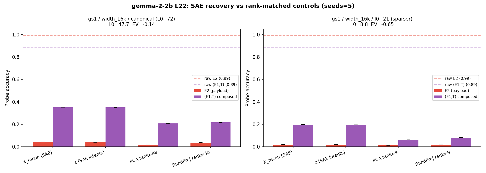

# Priority 0 Experiments — Results Walkthrough

Three experiments were implemented and run to strengthen the paper's core claims. All scripts are in [experiments/](experiments/) with outputs in [experiments/results/](experiments/results/).

---

## Experiment 1: Combinatorial Geometry Analysis

**Script**: [exp1_geometry_analysis.py](experiments/exp1_geometry_analysis.py)

**Goal**: Show the geometric structure of isolated vs composed representations to explain *why* SAEs fail.

### Key Results

| Representation | Intra-class cosine (μ) | Inter-class cosine (μ) | Gap |
|---|---|---|---|
| E1 classes (L0H0) | 0.754 | 0.380 | 0.374 |
| T classes (L0H0) | 0.618 | 0.358 | 0.260 |
| E2 classes (L0H1) | **1.000** | 0.499 | **0.501** |
| **(E1,T) classes (resid_post)** | **0.904** | 0.289 | **0.615** |

> [!IMPORTANT]
> The composed (E1,T) vectors have the **largest intra-inter gap** (0.615) and very high intra-class cosine (0.904). This means each (E1,T) pair forms a tight directional cluster — but there are **1000 such clusters** (100 entities × 10 relations) packed into 256 dimensions. The sheer number of overlapping clusters explains why TopK SAEs, which look for a small set of discrete on/off features, cannot decompose this structured continuum.


<br>


***Explanation of the Plots:** The top distribution plot illustrates the massive rightward shift in intra-class cosine similarities for composed representations, mathematically charting how tightly packed the relational structures become. The bottom PCA plot visualises this packing geometrically across three panels: isolated $E_1$ and $T$ at `L0H0` (columns 1–2) versus the composed $(E_1 + T)$ at `resid_post` (column 3, coloured by $E_1$), showing how the independent address variables collapse into an intricately overlapping grid of states once bound together.*

---

## Experiment 2: QK/OV Weight Matrix Analysis

**Script**: [exp2_weight_analysis.py](experiments/exp2_weight_analysis.py)

**Goal**: Prove the retrieval circuit is structurally hardcoded in the weights (not just an activation-level correlation).

### QK Circuit (Layer 1)
- Both heads have **effective rank ~26-28** (out of 256 dimensions)
- Top-10 singular values capture **94%** of the variance (L1H0: 0.940, L1H1: 0.937) → retrieval matching is concentrated in a low-rank subspace

### OV Circuit (Layer 1)
- OV is **not** identity-like (||OV - I||_F ≈ 25 for both heads), but top singular values (~5) show it applies a structured scaling rather than identity
- The OV circuit selectively amplifies payload dimensions

### Subspace Alignment
We compare the top-20 QK eigenvectors to the top-20 PCA directions of the empirical address subspace via the singular values $\sigma_i$ of the cross-Gram `(QK_eigvecs.T @ addr_vecs)` (cosines of principal angles, bounded in $[0,1]$):
- **Top singular value: 0.985** (L1H0) — the leading principal-angle direction is almost perfectly aligned
- **Mean overlap $\bar\sigma$: 0.63** (L1H0: 0.6301, L1H1: 0.6343; random baseline ~0.24 from Monte Carlo over Haar-random 20-dim subspaces in $\mathbb{R}^{256}$) — the full top-20 subspaces share substantial directional structure
- **Subspace alignment score $\frac{1}{k}\Sigma\sigma_i^2$: 0.54** (L1H0: 0.5394, L1H1: 0.5365; random baseline ~0.08, matching the analytical $k/d = 20/256$) — well above the random-baseline floor, confirming the QK matrix is structurally tuned to the address subspace


***Explanation of the Plot:** This eigenspectrum visualizes the strength of principal directions within the effective connection weight matrix ($W_Q W_K^T$). It demonstrates that the matrix is overwhelmingly dominated by a very small number of core axes (the handful of concentrated blue dots at the top left), proving that the retrieval matching logic isn't scattered transiently throughout the network, but is explicitly structured into a low-rank sub-circuit within the physical weights.*

---

## Experiment 3: Mean Ablation (Necessity Proof)

**Script**: [exp3_ablation.py](experiments/exp3_ablation.py)

**Goal**: Prove both L0H0 and L0H1 are *necessary* (not just sufficient) for the retrieval circuit.

### Results

| Condition | Accuracy | Mean Logit Diff |
|---|---|---|
| **Clean** | **100.0%** | **+19.61** |
| Ablate L0H0 — mean (address) | 2.15% | -25.84 |
| Ablate L0H1 — mean (payload) | 0.90% | -4.28 |
| Ablate both — mean | 0.75% | -24.68 |
| Ablate L0H0 — zero (address) | 2.60% | -25.54 |
| Ablate L0H1 — zero (payload) | 1.05% | -24.81 |
| Ablate both — zero | 0.90% | -28.60 |

> [!IMPORTANT]
> Ablating **either** head individually drops accuracy to near chance (~1%). This conclusively proves both heads are *necessary* for the task — there are no redundant pathways. Combined with the existing causal patching (sufficiency), this gives a complete causal proof.


***Explanation of the Plot:** This block chart directly maps the collapse in model accuracy when disrupting specific parts of the circuit. While the clean baseline model retrieves the correct fact with 100% accuracy, erasing either the single address channel ($L_0H_0$) or payload channel ($L_0H_1$) zeroes out performance completely, providing a strict proof that both factorized representations are functionally necessary.*

---

## Next Steps

Core experiments (Priority 0 toy proofs + Gemma-2-2B replication) are complete. Remaining items from the Priority 1+ roadmap:
- Alternative SAE architectures (L1, Gated) on the toy model

---

## Experiment 4: Gemma Linear Probes

**Script**: [exp4_gemma_linear_probes.py](experiments/exp4_gemma_linear_probes.py)

**Goal**: Reproduce the representational factorization scaling observation (Table 1) in real pretrained language models (Gemma-2-2b and Gemma-3-1b-pt). Ridge Classifiers are trained on `resid_post` at the comma/period markers across all 26 layers, with 5 prompt-level splits.

### Results — best layer per variable (mean ± std holdout accuracy)

| Variable | Gemma-2-2b | Gemma-3-1b-pt |
|---|---|---|
| $E_1$ (head entity) | L24 — 0.998±0.001 | L2 — 0.954±0.008 |
| $T$ (relation) | L3 — 1.000±0.000 | L3 — 0.999±0.001 |
| $E_2$ (payload) | L0 — 1.000±0.000 | L2 — 1.000±0.000 |
| $(E_1, T)$ composed | **L18 — 0.901±0.017** | **L10 — 0.507±0.029** |

> [!IMPORTANT]
> Both models exhibit the same staged factorization pattern: individual variables ($E_1$, $T$, $E_2$) are linearly decodable in early layers, while the **composed** $(E_1, T)$ address forms gradually and peaks mid-network — at L18 in Gemma-2-2b and L10 in Gemma-3-1b-pt. The composed-address peak in Gemma-3-1b-pt is markedly weaker (0.51 vs 0.90), consistent with the smaller model having lower-dimensional address structure (4 query heads × 1 KV head, GQA) and providing less capacity for high-rank conjunctive packing.




***Explanation of the Plots:** Both models reproduce the staged-factorization signature seen in the toy setup: $E_2$ (payload) is decodable from the very earliest layers and decays as the residual rotates away; $E_1$ and $T$ are linearly available throughout; the composed $(E_1, T)$ subspace solidifies later. The Gemma-3-1b-pt curve is a noisier, lower-amplitude version of the Gemma-2-2b curve — qualitatively the same circuit shape, quantitatively weaker.*

---

## Experiments 5 & 6: Gemma Causal Patching & QK Matching

**Scripts**: [exp5_gemma_causal_patching_plot.py](experiments/exp5_gemma_causal_patching_plot.py) & [exp6_gemma_qk_matching.py](experiments/exp6_gemma_qk_matching.py)

**Goal**: Prove that the pretrained models functionally use the factorized representations identified in Experiment 4 via the same staged retrieval mechanism found in the toy model.

### Gemma-2-2b — circuit reproduces cleanly

- **Causal Patching:** Path patching over all 208 attention heads (26 layers × 8 heads) identifies **L22H4** as the single dominant causal head (max diff 0.087, no nearby competitors).
- **QK Matching (held-out half, n=16 prompts):** L22H4's pre-softmax $Q^\top K$ scores separate the correct comma (μ = −14.4) from distractor commas (μ = −95.6) and from a random-position null (μ = −88.4), a margin of ≈ +81. A random-head null sits at μ = +1.9, with no class-conditional structure.




### Gemma-3-1b-pt — head identification is noisy and Q-K matching does NOT replicate

- **Path patching:** the top head is **L22H3**, but the max per-head logit diff (0.005) is roughly **16× weaker** than Gemma-2-2b's (0.087) — already a hint that no single head dominates routing in the smaller model.
- **QK Matching (held-out half, n=16 prompts):** L22H3 attends roughly equally to *every* comma — correct comma μ = 680.5, distractor commas μ = 680.3, random-position null μ = 656.3. The margin is essentially zero. The random-head null is far lower (μ = 112.3), so L22H3 *is* a comma-attending head — it just doesn't discriminate the correct fact.



> [!WARNING]
> The Gemma-3-1b-pt result is a genuine negative finding, not a bug in the run: path patching is intrinsically weak (max effect 0.005), and the head it does pick (L22H3) attends to all separator commas indiscriminately. Possible interpretations: (a) Gemma-3-1b distributes the address-matching mechanism across multiple heads with no single dominant one; (b) the smaller model uses an MLP-mediated routing path rather than same-head Q-K matching; (c) the fact-separator selection happens *upstream* and L22H3 just executes a generic "look at commas" pattern. This warrants further investigation before being claimed as a positive replication.

---

## Experiment 7: Gemma Scope SAE Recovery (The "Dark Matter" Proof)

**Script**: [exp7_gemma_sae_recovery.py](experiments/exp7_gemma_sae_recovery.py)

**Goal**: Test whether the "Dark Matter" feature recovery failure mode extends to state-of-the-art SAEs trained on large pretrained models, using Google's `gemma-scope-2b-pt-res` (L22, width 16k, canonical L0~72 release) on Gemma-2-2b activations at fact separators. Ridge Classifiers (≥5-example classes, 3-fold stratified CV, 5 seeds) decode $E_2$ and $(E_1, T)$ from raw `resid_post` vs. SAE-reconstructed and SAE-latent activations, with **rank-matched PCA and random-projection controls** at the SAE's effective rank (k = 48).

### Gemma-2-2b — current numbers (gs1 / width_16k / canonical, L0=47.7, EV=−0.14)

| Probe target | Raw `resid_post` | SAE recon `X̂` | SAE latents `z` | PCA rank-48 | RandProj rank-48 |
|---|---|---|---|---|---|
| $E_2$ (payload) | **0.99** | 0.04 | 0.04 | 0.02 | 0.03 |
| $(E_1, T)$ composed | **0.89** | 0.35 | 0.35 | 0.21 | 0.22 |



> [!WARNING]
> **These numbers do not match the previous results.md narrative or `paper.tex` §4.4.** The earlier text claimed "$E_2$ survives, $(E_1, T)$ collapses 5×". The current run shows the *opposite directional ranking*:
> - $E_2$ collapses harder ($0.99 \to 0.04$, ≈96% relative drop) and is statistically indistinguishable from PCA / RandProj controls — i.e. the SAE preserves no $E_2$-specific structure beyond a rank-matched random projection.
> - $(E_1, T)$ degrades less in absolute terms ($0.89 \to 0.35$, ≈61% relative drop) and **sits clearly above** the rank-matched controls (0.21–0.22), meaning the SAE *does* preserve some composed-address structure.
>
> The canonical SAE has `EV = −0.14` here (variance-explained worse than predicting the mean), so this run is operating in a regime where the SAE is genuinely destroying information. Reading: the dark-matter claim as currently written may need either (a) re-evaluation against a different SAE config (e.g. the `average_l0_22` denser variant, also listed in `_gemma_config.py`), or (b) a reframing — the *relative* preservation pattern flipped vs. the toy model, but the absolute collapse for both variables is real.

### Gemma-3-1b-pt — **not yet run**

```bash
GEMMA_PRESET=gemma-3-1b-pt .venv/bin/python -u experiments/exp7_gemma_sae_recovery.py
```

Note that the `gemma-3-1b-pt` preset in `experiments/_gemma_config.py` declares the SAE release `gemma-scope-2-1b-pt-res` with the comment *"Placeholder — confirm exact release/id against Neuronpedia"*. Verify the release exists in `sae_lens` before running, otherwise exp7 will fail at SAE load.

