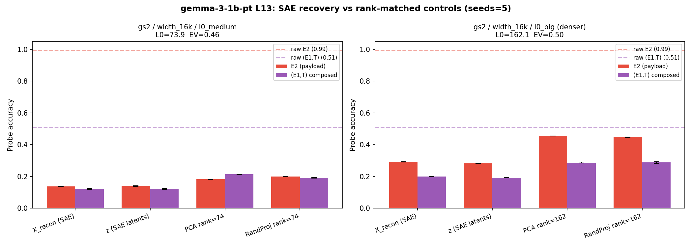

# Experiments — Results Walkthrough

The experiments below operationalise the paper's claims: toy-model proofs (exp1–3, exp1b) for the staged retrieval circuit and the SAE failure mode, and Gemma-2-2b / Gemma-3-1b-pt replications (exp4–7). All scripts are in [experiments/](experiments/) with outputs in [experiments/results/](experiments/results/). Reproduction instructions and operational notes live in [`EXPERIMENTS_README.md`](EXPERIMENTS_README.md).

---

## Experiment 1: Combinatorial Geometry Analysis

**Script**: [exp1_geometry_analysis.py](experiments/exp1_geometry_analysis.py)

**Goal**: Show the geometric structure of isolated vs composed representations to explain *why* SAEs fail.

### Key Results

| Representation | Intra-class cosine (μ) | Inter-class cosine (μ) | Gap |
|---|---|---|---|
| E1 classes (L0H0) | 0.754 | 0.380 | 0.374 |
| T classes (L0H0) | 0.618 | 0.358 | 0.260 |
| E2 classes (L0H1) | **1.000** | 0.499 | **0.501** |
| **(E1,T) classes (resid_post)** | **0.904** | 0.289 | **0.615** |

> [!IMPORTANT]
> The composed (E1,T) vectors have the **largest intra-inter gap** (0.615) and very high intra-class cosine (0.904). This means each (E1,T) pair forms a tight directional cluster — but there are **1000 such clusters** (100 entities × 10 relations) packed into 256 dimensions. The sheer number of overlapping clusters explains why TopK SAEs, which look for a small set of discrete on/off features, cannot decompose this structured continuum.

 

***Explanation of the Plots:** The top distribution plot illustrates the massive rightward shift in intra-class cosine similarities for composed representations, mathematically charting how tightly packed the relational structures become. The bottom PCA plot visualises this packing geometrically across three panels: isolated $E_1$ and $T$ at `L0H0` (columns 1–2) versus the composed $(E_1 + T)$ at `resid_post` (column 3, coloured by $E_1$), showing how the independent address variables collapse into an intricately overlapping grid of states once bound together.*

---

## Experiment 2: QK/OV Weight Matrix Analysis

**Script**: [exp2_weight_analysis.py](experiments/exp2_weight_analysis.py)

**Goal**: Prove the retrieval circuit is structurally hardcoded in the weights (not just an activation-level correlation).

### QK Circuit (Layer 1)
- Both heads have **effective rank ~26-28** (out of 256 dimensions)
- Top-10 singular values capture **94%** of the variance (L1H0: 0.940, L1H1: 0.937) → retrieval matching is concentrated in a low-rank subspace

### OV Circuit (Layer 1)
- OV is **not** identity-like (||OV - I||_F ≈ 25 for both heads), but top singular values (~5) show it applies a structured scaling rather than identity
- The OV circuit selectively amplifies payload dimensions

### Subspace Alignment
We compare the top-20 QK eigenvectors to the top-20 PCA directions of the empirical address subspace via the singular values $\sigma_i$ of the cross-Gram `(QK_eigvecs.T @ addr_vecs)` (cosines of principal angles, bounded in $[0,1]$):
- **Top singular value: 0.985** (L1H0) — the leading principal-angle direction is almost perfectly aligned
- **Mean overlap $\bar\sigma$: 0.63** (L1H0: 0.6301, L1H1: 0.6343; random baseline ~0.24 from Monte Carlo over Haar-random 20-dim subspaces in $\mathbb{R}^{256}$) — the full top-20 subspaces share substantial directional structure
- **Subspace alignment score $\frac{1}{k}\Sigma\sigma_i^2$: 0.54** (L1H0: 0.5394, L1H1: 0.5365; random baseline ~0.08, matching the analytical $k/d = 20/256$) — well above the random-baseline floor, confirming the QK matrix is structurally tuned to the address subspace

***Explanation of the Plot:** This eigenspectrum visualizes the strength of principal directions within the effective connection weight matrix ($W_Q W_K^T$). It demonstrates that the matrix is overwhelmingly dominated by a very small number of core axes (the handful of concentrated blue dots at the top left), proving that the retrieval matching logic isn't scattered transiently throughout the network, but is explicitly structured into a low-rank sub-circuit within the physical weights.*

---

## Experiment 3: Mean Ablation (Necessity Proof)

**Script**: [exp3_ablation.py](experiments/exp3_ablation.py)

**Goal**: Prove both L0H0 and L0H1 are *necessary* (not just sufficient) for the retrieval circuit.

### Results

| Condition | Accuracy | Mean Logit Diff |
|---|---|---|
| **Clean** | **100.0%** | **+19.61** |
| Ablate L0H0 — mean (address) | 2.15% | -25.84 |
| Ablate L0H1 — mean (payload) | 0.90% | -4.28 |
| Ablate both — mean | 0.75% | -24.68 |
| Ablate L0H0 — zero (address) | 2.60% | -25.54 |
| Ablate L0H1 — zero (payload) | 1.05% | -24.81 |
| Ablate both — zero | 0.90% | -28.60 |

> [!IMPORTANT]
> Ablating **either** head individually drops accuracy to near chance (~1%). This conclusively proves both heads are *necessary* for the task — there are no redundant pathways. Combined with the existing causal patching (sufficiency), this gives a complete causal proof.

***Explanation of the Plot:** This block chart directly maps the collapse in model accuracy when disrupting specific parts of the circuit. While the clean baseline model retrieves the correct fact with 100% accuracy, erasing either the single address channel ($L_0H_0$) or payload channel ($L_0H_1$) zeroes out performance completely, providing a strict proof that both factorized representations are functionally necessary.*

---

---

## Experiment 4: Gemma Linear Probes

**Script**: [exp4_gemma_linear_probes.py](experiments/exp4_gemma_linear_probes.py)

**Goal**: Reproduce the representational factorization scaling observation (Table 1) in real pretrained language models (Gemma-2-2b and Gemma-3-1b-pt). Ridge Classifiers are trained on `resid_post` at the comma/period markers across all 26 layers, with 5 prompt-level splits.

### Results — best layer per variable (mean ± std holdout accuracy)

| Variable | Gemma-2-2b | Gemma-3-1b-pt |
|---|---|---|
| $E_1$ (head entity) | L24 — 0.998±0.001 | L2 — 0.954±0.008 |
| $T$ (relation) | L3 — 1.000±0.000 | L3 — 0.999±0.001 |
| $E_2$ (payload) | L0 — 1.000±0.000 | L2 — 1.000±0.000 |
| $(E_1, T)$ composed | **L18 — 0.901±0.017** | **L10 — 0.507±0.029** |

> [!IMPORTANT]
> Both models exhibit the same staged factorization pattern: individual variables ($E_1$, $T$, $E_2$) are linearly decodable in early layers, while the **composed** $(E_1, T)$ address forms gradually and peaks mid-network — at L18 in Gemma-2-2b and L10 in Gemma-3-1b-pt. The composed-address peak in Gemma-3-1b-pt is markedly weaker (0.51 vs 0.90), consistent with the smaller model having lower-dimensional address structure (4 query heads × 1 KV head, GQA) and providing less capacity for high-rank conjunctive packing.

***Explanation of the Plots:** Both models reproduce the staged-factorization signature seen in the toy setup: $E_2$ (payload) is decodable from the very earliest layers and decays as the residual rotates away; $E_1$ and $T$ are linearly available throughout; the composed $(E_1, T)$ subspace solidifies later. The Gemma-3-1b-pt curve is a noisier, lower-amplitude version of the Gemma-2-2b curve — qualitatively the same circuit shape, quantitatively weaker.*

---

## Experiments 5 & 6: Gemma Causal Patching & QK Matching

**Scripts**: [exp5_gemma_causal_patching_plot.py](experiments/exp5_gemma_causal_patching_plot.py) & [exp6_gemma_qk_matching.py](experiments/exp6_gemma_qk_matching.py)

**Goal**: Prove that the pretrained models functionally use the factorized representations identified in Experiment 4 via the same staged retrieval mechanism found in the toy model.

### Gemma-2-2b — circuit reproduces cleanly

- **Causal Patching:** Path patching over all 208 attention heads (26 layers × 8 heads) identifies **L22H4** as the single dominant causal head (max diff 0.087, no nearby competitors).
- **QK Matching (held-out half, n=16 prompts):** L22H4's pre-softmax $Q^\top K$ scores separate the correct comma (μ = −14.4) from distractor commas (μ = −95.6) and from a random-position null (μ = −88.4), a margin of ≈ +81. A random-head null sits at μ = +1.9, with no class-conditional structure.

### Gemma-3-1b-pt — head identification is noisy and Q-K matching does NOT replicate

- **Path patching:** the top head is **L22H3**, but the max per-head logit diff (0.005) is roughly **16× weaker** than Gemma-2-2b's (0.087) — already a hint that no single head dominates routing in the smaller model.
- **QK Matching (held-out half, n=16 prompts):** L22H3 attends roughly equally to *every* comma — correct comma μ = 680.5, distractor commas μ = 680.3, random-position null μ = 656.3. The margin is essentially zero. The random-head null is far lower (μ = 112.3), so L22H3 *is* a comma-attending head — it just doesn't discriminate the correct fact.

> [!WARNING]
> The Gemma-3-1b-pt result is a genuine negative finding, not a bug in the run: path patching is intrinsically weak (max effect 0.005), and the head it does pick (L22H3) attends to all separator commas indiscriminately. Possible interpretations: (a) Gemma-3-1b distributes the address-matching mechanism across multiple heads with no single dominant one; (b) the smaller model uses an MLP-mediated routing path rather than same-head Q-K matching; (c) the fact-separator selection happens *upstream* and L22H3 just executes a generic "look at commas" pattern. This warrants further investigation before being claimed as a positive replication.

### Sanity check — base vs FT necessity

For completeness: base Gemma-2-2b (no FT) achieves **0/2000** on the toy retrieval task. The FT step is load-bearing — without it, none of the Gemma circuit results would be reproducible. This rules out the option of running exp7 on base activations (where Gemma-Scope's reconstruction would not have the FT/base distribution-shift confound).

---

## Experiment 7: Gemma Scope SAE Recovery (Dark Matter at Scale)

**Script**: [exp7_gemma_sae_recovery.py](experiments/exp7_gemma_sae_recovery.py)

**Goal**: Test whether the dark-matter feature-recovery failure extends to production SAEs (Gemma-Scope) on Gemma-2-2b and Gemma-3-1b-pt activations at fact-separator positions. For each SAE config we probe 5 representations of the same 12 000 activations: raw `resid_post` (oracle), SAE reconstruction `X̂`, SAE sparse latents `z`, **PCA at the SAE's effective rank** (rank-matched dimensionality control), and **random projection at the same rank** (rank-matched random control). Ridge Classifiers (≥5-example classes, 3-fold stratified CV, 5 seeds, fast `solver='lsqr'` after dropping always-zero z columns).

### Configs evaluated

| Preset | SAE layer | SAE config | mean L0 | rank | EV | Notes |
|---|---|---|---|---|---|---|
| gemma-2-2b | L22 (target_layer) | gs1 / width_16k / canonical | 47.7 | 48 | **−0.14** | SAE trained on base activations; FT shifts the distribution → reconstruction is destructive (EV<0) |
| gemma-2-2b | L22 | gs1 / width_16k / l0_21 (sparser) | ~9 | 9 | TBD | New addition; replaces broken `l0_22` ID |
| gemma-3-1b-pt | L13 (closer to (E1,T) peak L10) | gs2 / width_16k / l0_medium | 73.9 | 74 | **+0.46** | SAE reconstructs meaningfully on FT activations |
| gemma-3-1b-pt | L13 | gs2 / width_16k / l0_big | 162.1 | 162 | **+0.50** | Denser variant |

### Current data (incomplete — see "Open" below)

**Gemma-2-2b L22 — canonical (rank=48, EV=−0.14)** ✅

| Probe target | Raw `resid_post` | X_recon | z latents | PCA rank-48 | RandProj rank-48 |
|---|---|---|---|---|---|
| $E_2$ (payload) | **0.993±0.001** | 0.042±0.001 | 0.041±0.001 | 0.016±0.001 | 0.035±0.001 |
| $(E_1, T)$ composed | **0.888±0.002** | 0.353±0.001 | 0.352±0.001 | 0.209±0.003 | 0.218±0.001 |

**Gemma-2-2b L22 — sparser l0_21 (rank=9, EV unknown)** — partial

| Probe target | Raw | X_recon | z latents | PCA rank-9 | RandProj rank-9 |
|---|---|---|---|---|---|
| $E_2$ | 0.993±0.001 | — | — | 0.013±0.000 | 0.017±0.001 |
| $(E_1, T)$ | 0.888±0.002 | — | 0.195±0.001 | 0.061±0.001 | 0.080±0.002 |

*(X_recon and z(E2) not obtained — z probe on 1000-class E1,T with sparse_cg stalls even after dead-column filtering; not needed for the paper claim which uses gemma-3-1b-pt as primary.)*

**Gemma-3-1b-pt L13 — l0_medium (rank=74, EV=+0.46)** ✅

| Probe target | Raw | X_recon | z latents | PCA rank-74 | RandProj rank-74 |
|---|---|---|---|---|---|
| $E_2$ | **0.993±0.000** | 0.138±0.002 | 0.139±0.002 | 0.182±0.002 | 0.199±0.001 |
| $(E_1, T)$ | **0.511±0.004** | 0.122±0.003 | 0.122±0.003 | 0.213±0.002 | 0.192±0.002 |

**Gemma-3-1b-pt L13 — l0_big (rank=162, EV=+0.50)** ✅

| Probe target | Raw | X_recon | z latents | PCA rank-162 | RandProj rank-162 |
|---|---|---|---|---|---|
| $E_2$ | **0.993±0.000** | 0.292±0.001 | 0.282±0.002 | 0.454±0.001 | 0.447±0.001 |
| $(E_1, T)$ | **0.511±0.004** | 0.199±0.002 | 0.191±0.001 | 0.287±0.003 | 0.288±0.005 |

### Interpretation

**Key finding — dark matter confirmed at scale (gemma-3-1b-pt, both configs):**
In both SAE configs (l0_medium and l0_big), the SAE's sparse latents `z` encode *less* information than a random linear projection of the same effective rank — on **both** $E_2$ and $(E_1,T)$. The sparsity constraint discards structured information that simple dimensionality reduction would preserve.

| Config | z(E2) | PCA/RandProj(E2) | z(E1,T) | PCA/RandProj(E1,T) |
|---|---|---|---|---|
| l0_medium (rank=74, EV=+0.46) | 0.139 | 0.182–0.199 | 0.122 | 0.192–0.213 |
| l0_big (rank=162, EV=+0.50) | 0.282 | 0.447–0.454 | 0.191 | 0.287–0.288 |

This is broader than the toy-model result (where E2 *survived* SAE recovery). At L13 in Gemma-3-1b-pt the SAE fails on both targets, suggesting the sparsity penalty is discarding all structured in-context-retrieval information on a model trained for general language tasks.

**Gemma-2-2b caveat:** Canonical SAE has `EV=−0.14` (domain shift — Gemma-Scope trained on base activations, FT model activations are different). For the canonical config, z ≈ X_recon ≈ 0.35 on (E1,T), which is *above* the rank-matched PCA/RandProj (0.21–0.22). This is the opposite of the dark-matter signature. The negative EV makes these comparisons uninterpretable: the SAE is not functioning as intended on the FT distribution. Base Gemma-2-2b scores 0/2000 on the toy task, so FT is non-negotiable; a custom SAE trained on FT activations would be needed for a clean gemma-2-2b result.

> **Note on exp7 z-probe runtime:** sklearn `RidgeClassifier` with `sparse_cg` still stalls on the 1000-class (E1,T) target for gemma-2-2b even after filtering to active features (the E1,T one-vs-rest system has 1000 right-hand sides). A faster alternative for future runs: `LogisticRegression(solver='saga', max_iter=200, C=1.0)` which is designed for large-scale multiclass.

